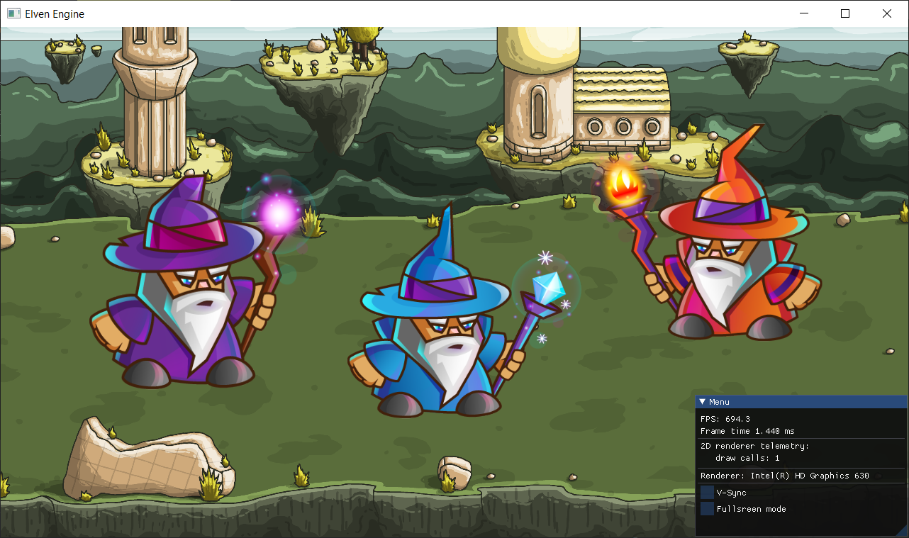

<h1 align="center"> Elven Engine 
 
  

  
</h1>

Elven Engine is primarily 2D/3D game engine developing from scratch.

## Getting Started

Visual Studio 2019/2022 support.
Windows platform only support for now (Linux and MacOS platforms are for the future support)

You can clone repository using git (**`--recursive`** is required to fetch all of the submodules):

`git clone --recursive https://github.com/kryvytskyidenys/ElvenEngine`

Firstly you need to install [cmake](https://cmake.org/) 3.10+ version (3.21+ for VS 2022 support)

To generate Visual Studio solution you can run script `configure-win-vs2022` from the `script` folder.

Or just call command from the build directory with your version of VS and platform name (architecture):

`cmake -G "Visual Studio Generator 17 2022" -A x64`

## Third party libraries
| Lib |  |
| ------ | ------ |
| [cmake](https://github.com/Kitware/CMake) | build system |
| [spdlog](https://github.com/gabime/spdlog) | header-only logging library |
| [GLFW](https://github.com/glfw/glfw) | windows, OpenGL contexts and handle input |
| [glad 2](https://glad.dav1d.de/) | OpenGL loader |
| [lia](https://github.com/kryvytskyidenys/lia) | my custom math library |
| [ImGui](https://github.com/kryvytskyidenys/imgui) | library using for GUI (visual-editor) |
| [stb image](https://github.com/nothings/stb/blob/master/stb_image.h) | image loader |

## Features (In Progress)

+ [x] Logging system (spdlog)
+ [x] Event sytem (event queue based system)
+ [x] Custom math library (separate project [lia](https://github.com/denyskryvytskyi/lia))
+ [x] Renderer core (support different graphics API)
  - [x] Shader Manager (shader files loading)
  - [x] Renderer API (VAO, VBO, Shader, Texture abstractions)
  - [x] Camera (orthographic, perspective)
  - [x] DSA OpenGL renderer api implementation
+ [ ] 2D Renderer
  - [x] Quad rendering
  - [x] Texture rendering
  - [x] Batch rendering (quad and texture)
  - [ ] SpriteComponent
  - [ ] Spritesheet animation
  - [ ] Text Rendering
+ [ ] 3D Renderer
  - [ ] Mesh/Model system
  - [ ] Primitives: cube, sphere, plane
  - [ ] Model loading (Assimp)
  - [ ] Lighting support
+ [ ] ECS
  - [ ] Scene
  - [ ] Data-oriented components structure
+ [ ] Visual-editor (based of ImGui)
  - [ ] Scene hierarchy
  - [ ] Inspector: transform component
  - [ ] Graphics stats
+ [ ] 2D Physics support (Box2d)
+ [ ] Multithreading support
  - [ ] Thread pool
+ [ ] Just cool stuff
  - [x] Fullscreen switch support
  - [x] Fly or FPS-like 3D camera support (CameraController)
+ [ ] Allocators (separate project):
  - [ ] Stack-based: simple stack, double-ended
  - [ ] Pool allocator
  - [ ] Aligned allocations
  - [ ] Single-Frame and Double-Buffered Memory Allocators

## Demo
#### Quad and texture batch rendering

## Features (Backlog)
- Renderer
    - Deffered Rendering
    - PBR Rendering
    - Vulkan, DirectX 11/12 support
- Scripting Engine (C++ and lua scripting)
- 3D Physics (Bullet)
- Audio engine
- Linux and Mac support
- Procedural terrain and world generation
- Artificial Intelligence
