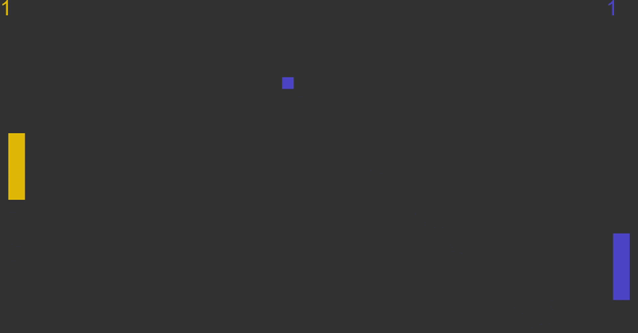
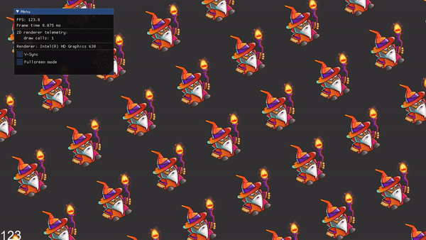

<h1 align="center"> Elven Engine 
 

</h1>

Elven Engine is primarily a 2D/3D game engine that is being developed from scratch.

## Getting Started

Windows platform only support for now (Linux and MacOS platforms are for future support)

You can clone the repository using git (**`--recursive`** is required to fetch all of the submodules):

`git clone --recursive https://github.com/kryvytskyidenys/ElvenEngine`

Firstly you need to install [cmake](https://cmake.org/) 3.10+ version (3.21+ for VS 2022 support).

### Windows
1. Configure and build third-party libraries: `scripts/setup-vendor.bat`
2. Configure Visual Studio solution for the Engine and Game/Example projects: `scripts/configure-vs2022`. 
3. Build a solution using one of the following ways:
   - cmake-based script `scripts/build.bat` (pass Debug/Release as an argument)
   - Visual Studio (`ElvenEngine.sln` file is placed in the `build` directory).

### CMake build options
You can modify configure file to enable/disable the following cmake options:
- **BUILD_SANDBOX** (default ON): Enable Sandbox2D and Sandbox3D projects build
- **BUILD_GAMES** (default ON): Enable Games build
- **PROFILE_MODE** (default ON): Enable Profiling (`PROFILE_MODE` preprocessor definition will be added)
- **EDITOR_MODE** (default ON): Enable Editor (`EDITOR_MODE` preprocessor definition will be added)
- **ASSIMP_MODE** (default ON): Enable Assimp library for 3D model loading (`ASSIMP_MODE` preprocessor definition will be added). **IMPORTANT**: ON - only Sandbox3D project will be configured, OFF - only Sandbox2D and Games projects will be configured.

## Features
+ [x] Logging system
+ [x] Event system (non-blocking event queue-based system, described architecture in the [article](https://denyskryvytskyi.github.io/event-system))
+ [x] Custom math library ([lia](https://github.com/denyskryvytskyi/lia))
+ [x] Renderer core (graphics API agnostic)
  - [x] Shaders loading
  - [x] Async textures loading
  - [x] Buffers, Shader, Texture abstractions
  - [x] Camera (orthographic, perspective)
  - [x] DSA OpenGL Renderer implementation
  - [x] Fullscreen switch support
+ [ ] 2D Renderer
  - [x] Quad rendering
  - [x] Texture rendering
  - [x] Batch rendering (quad and texture)
  - [x] Text Rendering
  - [ ] Spritesheet animation
+ [x] ECS (investigated different techniques and my particular architecture in the [article](https://denyskryvytskyi.github.io/ecs))
  - [x] Data-oriented cache-friendly components system architecture
  - [x] In-Engine components: Transform, Sprite, Text, Quad, Camera, RectTransform, AABB, Tag
  - [x] Components serialization
  - [x] Behavior component as the entity brain
  - [x] Optional Systems for usability
+ [x] Scene
  - [x] Interface to work with ECS
  - [x] Scene Graph based on SceneNodeComponent
  - [x] Scene serialization
+ [x] Data-driven architecture
  - [x] Load/Save engine settings from/to JSON files
+ [x] Sound engine
  - [x] Support formats: mp3, wav, ogg, flac etc.
  - [x] Add/Play/Pause/Stop functionality
+ [x] Just cool stuff
  - [x] Orthographic camera controller (OrthographicCameraController), that can be used if needed
  - [x] Fly(FPS-like) 3D camera support (CameraController)
+ [ ] 3D Renderer (IN PROGRESS)
  - [x] Phong Lighting
  - [x] Multiple light casters: spotlight, directional, and point light
  - [ ] Mesh-Material system
  - [ ] Primitives: cube, sphere, plane
  - [ ] Model loading (Assimp)
+ [ ] In-engine editor (based on ImGui)
  - [ ] Scene hierarchy
  - [ ] Properties: entity components
  - [ ] Graphics stats
+ [ ] Multithreading support
  - [ ] Thread pool

## Demo
### 2D Rendering
**Space Invaders full demo**

https://github.com/denyskryvytskyi/ElvenEngine/assets/25298585/f0d32c8b-1ed2-44e3-9c93-a781f3da4203

| Space Invades  | TRON |
| --- | --- |
|  |  |
| Ping Pong | Quad and texture batch rendering (20000 wizards) |
|  |  |

### 3D rendering
| Lighting environments with spotlight, directional, and point lights | Cube transformation and simple light |
| --- | --- | 
|  |  |

## Third-party libraries
| Lib |  |
| ------ | ------ |
| [cmake](https://github.com/Kitware/CMake) | build system |
| [spdlog](https://github.com/gabime/spdlog) | header-only logging library |
| [GLFW](https://github.com/glfw/glfw) | windows, OpenGL contexts and handle input |
| [glad 2](https://glad.dav1d.de/) | OpenGL loader |
| [lia](https://github.com/kryvytskyidenys/lia) | my custom math library |
| [ImGui](https://github.com/kryvytskyidenys/imgui) | library using for GUI (visual-editor) |
| [stb image](https://github.com/nothings/stb/blob/master/stb_image.h) | image loader |
| [json](https://github.com/nlohmann/json) | json lib for serialization and data-driven architecture |
| [irrKlang](https://www.ambiera.com/irrklang/) | sound library |
| [fmt](https://github.com/fmtlib/fmt) | formatting library |
| [freetype](https://freetype.org/) | fonts rendering |
| [assimp](https://github.com/assimp/assimp) | 3D moodel loading |
