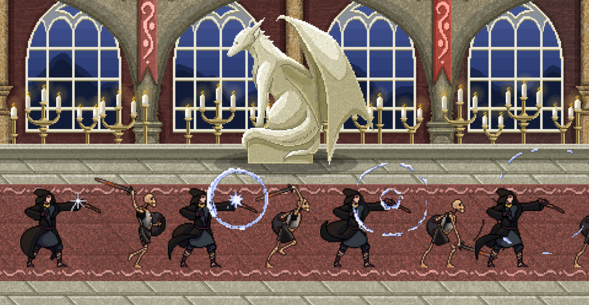
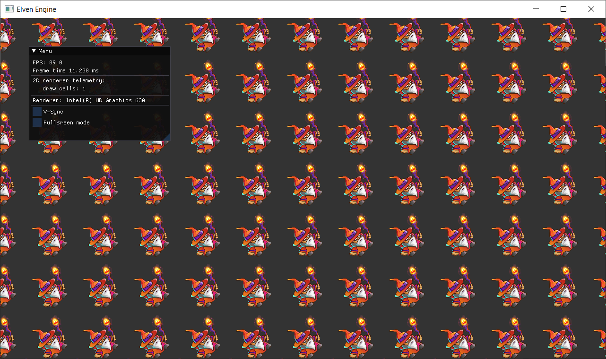

<h1 align="center"> Elven Engine 
 
  

  
</h1>

Elven Engine is primarily 2D/3D game engine that is being developed from scratch.

## Getting Started

Windows platform only support for now (Linux and MacOS platforms are for the future support)

You can clone repository using git (**`--recursive`** is required to fetch all of the submodules):

`git clone --recursive https://github.com/kryvytskyidenys/ElvenEngine`

Firstly you need to install [cmake](https://cmake.org/) 3.10+ version (3.21+ for VS 2022 support).

### Windows
1. Configure and build third party libraries: `scripts/setup-vendor.bat`
2. Configure Visual Studio solution for the Engine and Game/Example projects: `scripts/configure-vs2022`.
    
    2.1. Or run command from the build directory with your generator and architecture: `cmake -G "Visual Studio Generator 17 2022" -A x64`
3. Build solution (if you want to build using cmake) both Debug/Release config (pass it as argument): `scripts/build.bat`

## Features
+ [x] Logging system
+ [x] Event sytem (non-blocking event queue based system)
+ [x] Custom math library ([lia](https://github.com/denyskryvytskyi/lia))
+ [x] Renderer core (graphics API agnostic)
  - [x] Shaders loading
  - [x] Async textures loading
  - [x] Buffers, Shader, Texture abstractions
  - [x] Camera (orthographic, perspective)
  - [x] DSA OpenGL Renderer implementation
  - [x] Fullscreen switch support
+ [ ] 2D Renderer
  - [x] Quad rendering
  - [x] Texture rendering
  - [x] Batch rendering (quad and texture)
  - [x] Text Rendering
  - [ ] Spritesheet animation
+ [x] ECS
  - [x] Data-oriented cache-friendly components system architecture
  - [x] In-Engine components: Transform, Sprite, Text, Quad, Camera, RectTransform
  - [x] Components serialization
  - [x] Behavior component as the entity brain
  - [x] Optional Systems for usability
  - [x] Scene as the ECS coordinator
  - [x] Scene serialization
+ [x] Data-driven architecture
  - [x] Load/Save engine settings from/to json files
+ [x] Sound engine
  - [x] Support formats: mp3, wav, ogg, flac etc.
  - [x] Add/Play/Pause/Stop functionality
+ [x] Just cool stuff
  - [x] Orthographic camera controller (OrthographicCameraController), that can be used if needed
  - [x] Fly(FPS-like) 3D camera support (CameraController)
+ [ ] 3D Renderer
  - [ ] Mesh/Model system
  - [ ] Primitives: cube, sphere, plane
  - [ ] Model loading (Assimp)
  - [ ] Lighting support
+ [ ] In-engine editor (based on ImGui)
  - [ ] Scene hierarchy
  - [ ] Properties: entity components
  - [ ] Graphics stats
+ [ ] Multithreading support
  - [ ] Thread pool

## Demo
#### Ping-pong

#### TRON

#### Sprite rendering

#### Quad and texture batch rendering (20000 wizards)

#### 3D rendering

## Third party libraries
| Lib |  |
| ------ | ------ |
| [cmake](https://github.com/Kitware/CMake) | build system |
| [spdlog](https://github.com/gabime/spdlog) | header-only logging library |
| [GLFW](https://github.com/glfw/glfw) | windows, OpenGL contexts and handle input |
| [glad 2](https://glad.dav1d.de/) | OpenGL loader |
| [lia](https://github.com/kryvytskyidenys/lia) | my custom math library |
| [ImGui](https://github.com/kryvytskyidenys/imgui) | library using for GUI (visual-editor) |
| [stb image](https://github.com/nothings/stb/blob/master/stb_image.h) | image loader |
| [json](https://github.com/nlohmann/json) | json lib for serialization and data-driven architecture |
| [irrKlang](https://www.ambiera.com/irrklang/) | sound library |
